# Deva Business Journey and Operating Flowchart

This is a practical, non-technical walkthrough of how a bar, restaurant, or wine-shop owner runs the business in Deva—from the first account through daily closing. The three connected maps are intentionally separated so they stay readable on desktop and mobile.

## Who does what

| Person | What they use Deva for |
|---|---|
| Super Admin | Creates a business and its first owner account; can rename, suspend, restore, or delete a business and reset access. |
| Business Owner / Business Admin | Creates branches, operating settings, managers and staff; sees all permitted branches and management results. |
| Branch Manager | Runs one branch: stock, sales, restaurant, growth, staff controls, settings, closing, profit and reports. |
| Stock Manager | Maintains products, suppliers, purchases, counts, transfers, returns, wastage and adjustments. |
| Cashier | Opens a shift, makes counter sales, collects restaurant payments, issues receipts and submits the shift. |
| Waiter | Opens a shift, selects a table, records items and portions, sends orders, serves guests and requests payment. |
| Auditor | Reviews permitted stock, sales, audit and report information without operational control. |
| Customer | Scans a table QR or opens the direct store, views the menu in the selected language, and can submit a guest order where enabled. |

## Flow 1 — Owner setup and control

```mermaid
flowchart LR
  subgraph platform["Platform setup"]
    superAdmin["Super Admin signs in"]
    createBusiness["Create business and owner credential"]
    ownerReceives["Owner receives username and generated password"]
    recovery["Owner sets recovery answer and changes password"]
    superAdmin --> createBusiness --> ownerReceives --> recovery
  end

  subgraph business["Business setup"]
    ownerLogin["Business Owner signs in"]
    profile["Review or edit business name"]
    branches["Create branches"]
    branchType{"Choose outlet type"}
    bar["Bar and restaurant"]
    wine["Wine shop"]
    settings["Configure tax, receipts, payments and hours"]
    ownerLogin --> profile --> branches --> branchType
    branchType -->|"Restaurant service"| bar
    branchType -->|"Retail sales"| wine
    bar --> settings
    wine --> settings
  end

  subgraph people["People and access"]
    roles["Create manager, stock, cashier, waiter and auditor accounts"]
    generatedPassword["Generate strong password and share securely"]
    scopedAccess["Assign each account to a branch and role"]
    staffLogin["Staff signs in to role-specific workspace"]
    roles --> generatedPassword --> scopedAccess --> staffLogin
  end

  subgraph oversight["Owner oversight"]
    dailyControl["Review branches, staff and live activity"]
    salesProfit["Monitor sales, stock, expenses and profit"]
    reports["Generate closing, stock, waiter and management reports"]
    security["Reset passwords, suspend access or delete business"]
    dailyControl --> salesProfit --> reports --> security
  end

  recovery --> ownerLogin
  settings --> roles
  staffLogin --> dailyControl
```

### Owner’s first-day checklist

1. Sign in with the credential created by the Super Admin.
2. Set the recovery answer and replace the temporary password.
3. Confirm the business name, then create each physical outlet.
4. Select the correct outlet type. A restaurant branch receives table, QR, kitchen and waiter features; a wine shop receives retail sales and bottle/package workflows.
5. Configure tax, receipt, accepted payment methods and operating hours.
6. Add products, portions, prices and opening stock.
7. Create staff accounts using the password generator and assign one real person to the correct branch and role.
8. Ask each employee to sign in once before the outlet opens.

## Flow 2 — Restaurant, customer, waiter and kitchen journey

```mermaid
flowchart LR
  subgraph setup["Manager prepares service"]
    catalogue["Create products, recipes, portions and prices"]
    publish["Publish menu items with photos and availability"]
    tables["Create tables and QR codes"]
    catalogue --> publish --> tables
  end

  subgraph customer["Customer journey"]
    scan["Customer scans table QR or opens direct store"]
    browse["Browse translated menu, search and select items"]
    request["Submit guest order or call waiter"]
    reserve["Book or join waitlist"]
    scan --> browse --> request
    reserve --> seated["Manager assigns table and seats guest"]
  end

  subgraph service["Waiter and kitchen journey"]
    waiterShift["Waiter starts assigned shift"]
    selectTable["Select table and create order"]
    addItems["Add items, portions and modifiers"]
    kitchenTicket["Send order to kitchen"]
    preparing["Kitchen marks preparing"]
    ready["Kitchen marks ready"]
    served["Waiter serves and requests payment"]
    waiterShift --> selectTable --> addItems --> kitchenTicket --> preparing --> ready --> served
  end

  subgraph payment["Cashier and control"]
    settle["Cashier or manager settles cash, card, UPI or split payment"]
    stockDeduct["Paid order deducts recipe and product stock"]
    receipt["Receipt, loyalty and feedback recorded"]
    unresolved{"Any unresolved order?"}
    reconcile["Manager reviews cancellation, void or shift difference"]
    close["Shift approved and order locked in reports"]
    settle --> stockDeduct --> receipt --> unresolved
    unresolved -->|"Yes"| reconcile --> close
    unresolved -->|"No"| close
  end

  tables --> scan
  request --> guestReview["Manager accepts or rejects guest request"]
  guestReview --> selectTable
  seated --> selectTable
  publish --> addItems
  served --> settle
```

### How the customer sees the menu

1. The manager opens **Restaurant → Tables** and creates a table. Deva produces that table’s QR.
2. Download or print the QR and place it on the table.
3. The customer scans it with the phone camera. No staff login is required.
4. The public screen shows the outlet, table, categories, photos, descriptions, prices, dietary markers and available portions.
5. The customer can choose English, हिन्दी or मराठी. The whole public menu changes language while product names remain recognizable.
6. If guest ordering is enabled, the request appears in **Guest Orders** for manager acceptance. Otherwise, the waiter records the selected items in **Take Orders**.

### Order safeguards

- Every order stays linked to its table, waiter and shift.
- Accepted orders cannot silently disappear.
- Cancellation or voiding requires a reason and is visible to management.
- Payment can be cash, card, UPI or a split payment.
- A paid order updates stock and becomes part of sales, profit, waiter and closing reports.
- Open, served, or awaiting-payment orders remain unresolved until settled or manager-approved.

## Flow 3 — Daily stock, sales, growth and closing

```mermaid
flowchart LR
  subgraph opening["Open the outlet"]
    managerReview["Manager reviews staff, devices and opening status"]
    shifts["Cashier and waiter open assigned shifts"]
    stockCheck["Stock manager checks low stock, batches and expiry"]
    managerReview --> shifts
    managerReview --> stockCheck
  end

  subgraph supply["Stock and purchasing"]
    supplier["Maintain suppliers and purchase invoices"]
    receive["Receive stock into immutable ledger"]
    controls["Record stocktake, transfer, return, wastage or adjustment"]
    supplier --> receive --> controls
  end

  subgraph trading["Trading day"]
    counter["Cashier records counter or wine-shop sale"]
    restaurantSale["Restaurant orders reach payment"]
    payment["Collect cash, card, UPI or split payment"]
    ledger["Sales and stock ledgers update automatically"]
    counter --> payment
    restaurantSale --> payment --> ledger
  end

  subgraph growth["Customer growth"]
    consent["Capture customer consent and loyalty"]
    campaign["Run offers and direct-store channels"]
    payout["Reconcile channel settlements and feedback"]
    consent --> campaign --> payout
  end

  subgraph closing["Control and improve"]
    shiftClose["Staff submit shift with cash and unresolved orders"]
    managerApprove{"Manager finds a difference?"}
    investigate["Review waiter orders, refunds, voids and audit trail"]
    approve["Approve shift and daily closing"]
    analytics["Review revenue, margin, expenses, stock and branch comparison"]
    export["Generate PDF or XLSX reports in selected language"]
    decision["Owner decides restock, pricing, promotion or staffing action"]
    shiftClose --> managerApprove
    managerApprove -->|"Yes"| investigate --> approve
    managerApprove -->|"No"| approve
    approve --> analytics --> export --> decision
  end

  stockCheck --> supplier
  stockCheck --> counter
  receive --> counter
  shifts --> counter
  shifts --> restaurantSale
  ledger --> shiftClose
  ledger --> consent
  payout --> analytics
  decision --> managerReview
```

### Normal closing sequence

1. Cashier and waiter stop taking new work, settle pending bills, count collections and submit their shifts.
2. Deva highlights unresolved tables, cash differences, discounts, refunds, voids and cancelled items.
3. The manager investigates anything unexpected, records the reason and approves the shift.
4. The manager checks closing sales, payment mix, stock movement, wastage and expenses.
5. The owner reviews sales and profit across branches and downloads the needed PDF or XLSX report.
6. The owner uses the results to order stock, adjust prices, plan offers and schedule staff for the next day.

## What each main menu area means

| Area | Practical purpose |
|---|---|
| Home | Choose a branch and see the work available to the signed-in role. |
| Stock | Products, portions, suppliers, purchases, balances, batches, counts, transfers, returns, adjustments and wastage. |
| Sales | Counter or wine-shop billing, payments, sale history and controlled refunds. |
| Restaurant | Orders, kitchen, guest requests, reservations, tables, QR codes, menu, recipes and billing. |
| Growth | Customers, consent, loyalty, offers, direct store, order channels, settlements and feedback. |
| Owner Control | Vendors, procurement, workforce, shared templates and management automations. |
| Ecosystem | External API keys, webhooks and delivery health for approved integrations. |
| Sales & Profit | Revenue, gross profit, operating expenses, stock value, waiter performance and branch comparison. |
| Reports | Daily closing, consolidated management, sales, product, ML consumption, stock, purchase, wastage, waiter, unresolved-order, margin and comparison reports. |
| Settings | Tax, receipts, payments, operating hours and branch devices. |

The application shows only the areas allowed for the signed-in role. A waiter should not see owner controls; a cashier should not edit stock; an auditor should not perform sales; and a branch user cannot access another business by changing a link.
